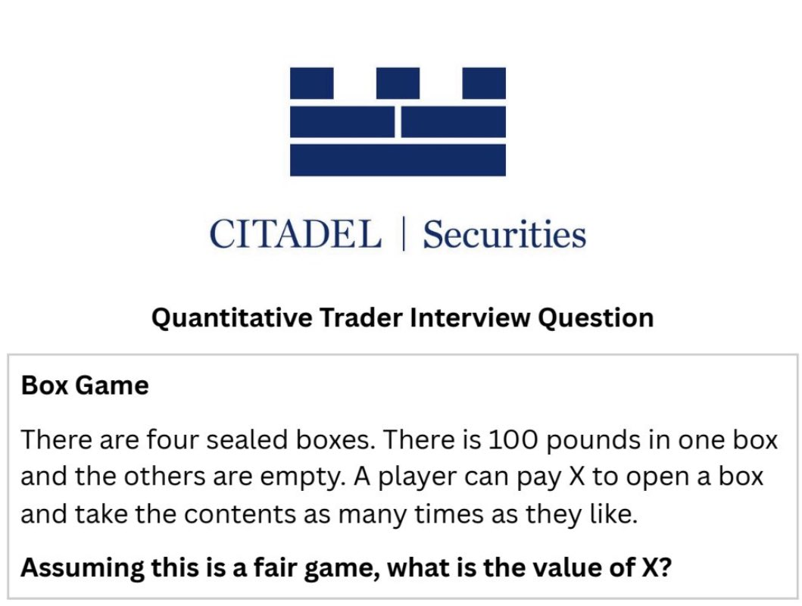

The question is shared here: https://x.com/hamptonism/status/1903635109795770550

## Solution

The expected net gain, after paying an amount $X$ for each attempt, is calculated using the following formula

$E = \frac{1}{4}*(100 - X) + \frac{3}{4}*\frac{1}{3}(100 - 2X) + \frac{3}{4}*\frac{2}{3}*\frac{1}{2}*(100 - 3X) + \frac{3}{4}*\frac{2}{3}*\frac{1}{2}*1*(100 - 4X)$
In the fair game, Expected net gain should be zero.
$0 = \frac{1}{4}*(100 - X) + \frac{3}{4}*\frac{1}{3}(100 - 2X) + \frac{3}{4}*\frac{2}{3}*\frac{1}{2}*(100 - 3X) + \frac{3}{4}*\frac{2}{3}*\frac{1}{2}*1*(100 - 4X)$
$0 = 600 - 6X + 600 - 12X + 600 - 18X + 600 - 24X$
$0 = 2400 - 60X$
$X = 40$

Check the python code for simulating $X = 40$.